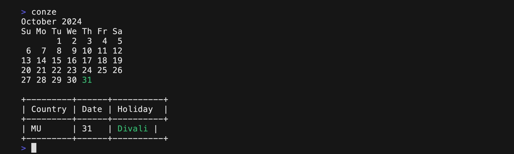
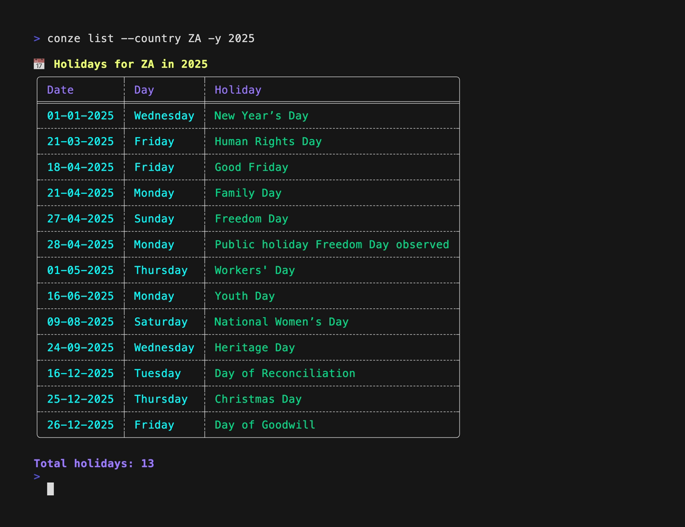
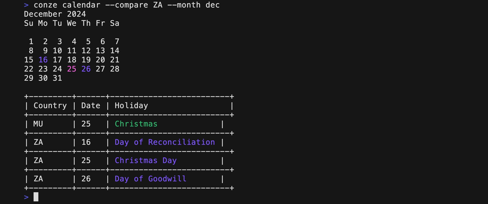
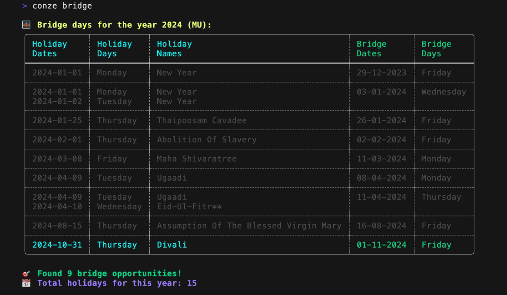

# Conze

**Conze** is a command-line tool that allows you to view holidays and long weekends, and compare holiday schedules between countries from your terminal.  

## Features

- **List holidays** for any supported country and year.
- **Compare holidays** between different countries.
- Explore holidays using subcommands like `bridge` for long weekends and `calendar` for holiday comparisons.
- Configure a **default country** for convenience.

## Installation
You can install `conze` using one of the following methods:

### Using Cargo

If you have Rust's package manager, Cargo, installed, you can install revq with:

```bash
cargo install conze
```

### Using Homebrew

For macOS users, you can install `conze` using Homebrew:

```bash
brew install k3ii/tap/conze

```

Check the [release page](https://github.com/k3ii/conze/releases) to install the pre-built binaries.

## Getting starrted

### Configure Default Country

To begin, set the default country using the following command:

```bash

conze config --default-country MU
```

Currently, only the following countries are supported:
* France (FR)
* Mauritius (MU)
* South Africa (ZA)

This project has been possible thanks to the [dataset](https://github.com/nicolasstrands/data-konzer) by [Nicolas Strands](https://github.com/nicolasstrands). If you'd like support for another country, feel free to contribute to the dataset.

You can check the current default country by running:
```bash
conze config show
```


## Examples of Commands

### List Holidays

To list holidays for the current month and the default country:
```bash
conze
```


You can also list holidays for a specific country and year:

```bash
conze list --country ZA --year 2025
```


### Compare Holidays Between Countries

Compare holidays between countries (e.g., Mauritius and South Africa) for a specific month:
```bash
conze calendar --compare ZA --month 12
```

### View possible long weekends

View long weekend for the current year and default country.

```bash
conze bridge 
```


To view long weekends for a different year and country:
```bash
conze bridge --country ZA --year 2025 
```

To view long weekends for a specific month and year in a different country:
```bash
conze bridge --country FR --month jan --year 2026 
```


## Available Subcommands

 * `list`: Lists holidays for a specific country and year.
 * `calendar`: View and compare holidays between countries.
 * `bridge`: View possible long weekends (bridge holidays).
 * `config`: Configure the default country setting.
 * `help`: Show help information for all commands.

## Contributing

Contributions are welcome! To get involved:

 *  Fork the repository.
 *  Create a new branch for your feature or bug fix.
 *  Make your changes.
 *  Submit a pull request.


## License

This project is licensed under the MIT License.
